# Backwoods Wald

## Level 1 Bumm! und Kaputt

Im 1. Level lernt man, wie man eine "fire-trap" plaziert, um etwas in die Luft zu jagen.

```js
hero.buildXY("fire-trap", 35, 35);
hero.buildXY("fire-trap", 35, 29);
hero.moveLeft(2);
hero.moveRight(3);
```


---

## Level 2 Verteidigung von Plainswood

Im 2. Level lernt man, wie man einen Zaun baut.

```js
hero.buildXY("fence", 40, 52);
hero.buildXY("fence", 40, 20);
```


---

## Level 3 Ein falscher Schritt

Im 3. Level lernt man, wie man sich nach Koordinaten bewegen kann.

```js
hero.moveXY(11, 36);
hero.moveXY(35, 25);
hero.moveXY(40, 56);
hero.moveXY(77, 58);
```


---

## Level 4 Gewundener Pfad

Im 4. Level kommt nichts neues dazu.

```js
hero.moveXY(36, 59);
hero.moveXY(37, 13);
hero.buildXY("fence", 72, 25)
```


---

## Level 5 Kammern im Wald

Im 5. Level 

```js
hero.moveXY(19, 33);
var enemy = hero.findNearestEnemy();
if(enemy) {
    hero.attack(enemy);
    hero.attack(enemy);
}

hero.moveXY(49, 51);
enemy = hero.findNearestEnemy();
if(enemy) {
    hero.attack(enemy);
    hero.attack(enemy);
}

hero.moveXY(58, 14);
enemy = hero.findNearestEnemy();
if(enemy) {
    hero.attack(enemy);
    hero.attack(enemy);
}
```


---

## Level 6 Nine Gems

Im 6. Level kommt nichts neues dazu.

```js
hero.moveXY(32, 48);
hero.moveXY(70, 48);
hero.moveXY(31, 10);
hero.moveXY(32, 36);
```


---

## Level 7 Waldflucht

Im 7. Level kommt nichts neues dazu.

```js
while(true) {
    hero.moveXY(56, 44);
    hero.moveXY(40, 56);
    hero.moveXY(24, 44);
    hero.moveXY(24, 24);
    hero.moveXY(40, 12);
    hero.moveXY(56, 24);    
}
```


---

## Level 8 If-Anweisung

Im 8. Level lernt man die If-Anweisungen kennen.

```js
while(true) {
    var enemy = hero.findNearestEnemy();
    if(enemy)
        hero.attack(enemy);
}
```


---

## Level 9 Patrouillenmeister

Im 9. Level kommt nichts neues dazu.

```js
while (true) {
    var enemy = hero.findNearestEnemy();
    if (enemy) {
        hero.attack(enemy);
    }
}
```


---

## Level 10 Hinterwald Hinterhalt

Im 10. Level kommt nichts neues dazu.

```js
hero.moveXY(24, 42);
var enemy = hero.findNearestEnemy();
if(enemy) {
    hero.attack(enemy);
    hero.attack(enemy);
}

hero.moveXY(27, 60);
enemy = hero.findNearestEnemy();
if(enemy) {
    hero.attack(enemy);
}

hero.moveXY(42, 50);
enemy = hero.findNearestEnemy();
if(enemy){
    hero.attack(enemy);
    hero.attack(enemy);
}
hero.moveXY(39, 24);
enemy = hero.findNearestEnemy();
if(enemy){
    hero.attack(enemy);
    hero.attack(enemy);
}
```


---

## Level 11 Patrol Buster A

Im 11. Level kommt nichts neues dazu.

```js
while (true) {
    var enemy = hero.findNearestEnemy();
    if (enemy) {
        hero.attack(enemy);
    }
}
```


---

## Level 12 Picknick-Buster

Im 12 Level kommt nichts neues dazu.

```js
while (true) {
    var enemy = hero.findNearestEnemy();
    if(enemy)
    hero.attack(enemy);
}
```


---

## Level 13 Adlerauge

Im 13. Level kommt nichts neues dazu.

```js
while (true) {
    var enemy = hero.findNearestEnemy();
    if(enemy)
    hero.attack(enemy);
}
```


---

## Level 14 Rücken an Rücken

Im 14. Level kommt noch die else-Anweisung dazu.

```js
while(true) {
    var enemy = hero.findNearestEnemy();
    if (enemy) {
        hero.attack(enemy);
    }
    else {
        hero.moveXY(40, 35)
    }
}
```


---

## Level 15 Daumenbeisser

Im 15. Level lernt man, dass man Anstatt (true) auch (20 == 20) verwenden kann.  20 = 20 also ist die Aussage wahr. Wäre es z.B.    19 == 20 wäre die Aussage falsch.

```js
if (2 + 2 == 4) {
    hero.say("Hey!");
}
if (2 + 3 == 5) {
    hero.say("Yes, you!");
}

if (true) {
    hero.say("Come at me!");
}

if (20 == 20) { 
    hero.say("Come when u trust");
}
```


---

## Level 16 Dorfwächter

Im 16. Level kommt nichts neues dazu.

```js
while(true) {
    hero.moveXY(35, 34);
    var leftEnemy = hero.findNearestEnemy();
    if (leftEnemy) {
        hero.attack(leftEnemy);
        hero.attack(leftEnemy);
    }
    hero.moveXY(60, 31);
    var rightEnemy = hero.findNearestEnemy();
    if(rightEnemy) {
        hero.attack(rightEnemy);
        hero.attack(rightEnemy);
}
}
```


---

## Level 17 Edelsteine oder Tod

Im 17. Level kommt nichts neues dazu.

```js
if (2 + 1 + 1 == 3) { 
    hero.moveXY(5, 15);
}
if (3 + 2 == 5) {
	hero.moveXY(15, 40);
}
if (2 + 2 == 4) {
	hero.moveXY(25, 15);
}
if (1 + 1 < 3) {
    var enemy = hero.findNearestEnemy();
    hero.attack(enemy);
    hero.attack(enemy);
}
if (5 < 4) {
	hero.moveXY(40, 55);
}
if (false) {
	hero.moveXY(50, 10);
}
if (true) {
	hero.moveXY(55, 25);
}
```


---

## Level 18 Burls Boolean Beete

Im Level 18. kommt nivhts neues dazu.

```js
hero.say(false);

// Frage: 3 == 3
hero.say(true);

// Frage: "Three" == 3
hero.say(false);

// Frage: "Three" == "Three"
hero.say(true);

// Frage: 1 + 2 == 3
hero.say(true);
```


---

## Level 19 Die Dornenbuschfarm

Im 19. Level kommt nichts neues dazu.

```js
while(true) {
    hero.moveXY(43, 50);
    var top = hero.findNearestEnemy();
    if (top) {
        hero.buildXY("fire-trap", 43, 50);
    }

    hero.moveXY(25, 34);
    var left = hero.findNearestEnemy();
    if(left) {
        hero.buildXY("fire-trap", 25, 34);
    }
    hero.moveXY(43, 20);
    var down = hero.findNearestEnemy();
    if(down) {
        hero.buildXY("fire-trap", 43, 20);
    }
}
```


---

## Level 20 Sturm auf die Türme von Areth

Im 20. Level kommt nichts neues dazu.

```js
hero.moveXY(55, 14);
hero.moveXY(92, 9);
hero.buildXY("fire-trap", 94, 19);
hero.moveXY(56, 14);
hero.buildXY("fire-trap", 90, 53);
hero.moveXY(71, 61);
hero.buildXY("fire-trap", 60, 62);
hero.say('retreat');
hero.moveXY(11, 28);
hero.moveXY(-16, 39);
```


---

## Level 21 Lager der Oger

Im 21. Level kommt nichts neues dazu.

```js
hero.moveXY(44, 31);
while(true) {
    var enemy = hero.findNearestEnemy();
    if(enemy){
        hero.attack(enemy);
        hero.attack(enemy);
    }
    else{
    hero.attack("Chest");
    }
}
```


---

## Level 22 Waldland Hackebeil

Im 22. Level kommt eine neue Attacke dazu ("cleave"). Cleave ist eine Flächenattacke, die eine Coldown hat.

```js
hero.moveXY(23, 23);
while(true) {
    var enemy = hero.findNearestEnemy();
    if (hero.isReady("cleave")) {
        hero.cleave(enemy);
    }
    var enemy = hero.findNearestEnemy();
    if (!enemy) {
        hero.attack(enemy);
    }
   else if( enemy){
   hero.attack(enemy);
   }
   else if (hero.isReady("cleave") && hero.distanceTo(enemy) < 10) {
       hero.cleave(enemy);
   }
}
```


---

## Level 23 Peek-a-boom!

Im 23. Level

```js
while(true) {
    var enemy = hero.findNearestEnemy();
    if(enemy) {
        hero.buildXY("fire-trap", 41, 24);
    }
    else {
        hero.moveXY(19, 19);
}
}
```


---

## Level 24 Duellgründe

Im 24. Level kommt nichts neues dazu.

```js
while(true) {
    hero.buildXY("fire-trap", 31, 31);
    hero.moveXY(18, 21);
}
```


---

## Level 25 Hinterwaldspatt

Im 25. Level kommt dazu, dass man seine neues Attacke "cleave" abwarten kann bis sie wieder einsatz fähig ist.

```js
while(true) {
    var enemy = hero.findNearestEnemy();
    if(hero.isReady("cleave")) {
        hero.cleave(enemy)
    }
    else {
        hero.attack(enemy);
        hero.attack(enemy);
    }
```


---

## Level 26 Elseweyr

Im 26. Level kommt nichts neues dazu.

```js
while(true) {
    var enemy = hero.findNearestEnemy();
    if(hero.isReady("cleave")) {
        hero.cleave();
    }
    else{
        hero.attack(enemy);
    }
}
```
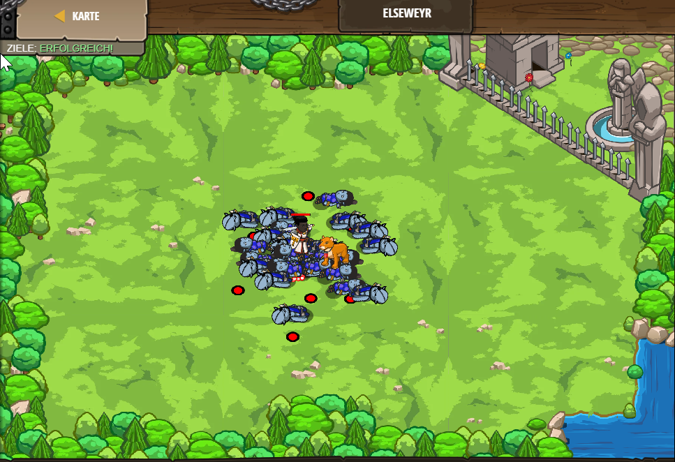

---

## Level 27 Backwoods Standoof A

Im 27. Level kommt nichts neues dazu.

```js
while(true) {
    var enemy = hero.findNearestEnemy();
    if(hero.isReady("cleave")) {
        hero.cleave(enemy);
    }
    else {
        hero.attack(enemy);
    }
}
```


---

## Level 28 Schildansturm

Im 28. Level lernt man, wie man ein Schild benutzt.

```js
while(true) {
    var enemy = hero.findNearestEnemy();
    if(hero.isReady("cleave")) {
        hero.cleave(enemy);
    }
    else {
        hero.shield();
    }
    }
```


---

## Level 29 Zergenernte

Im 29. Level kommt nichts neues dazu.

```js
while(true) {
    var enemy = hero.findNearestEnemy();
    if(hero.isReady("cleave")) {
        hero.cleave(enemy);
    }
    else {
        hero.shield();
    }

    }
```


---

## Level 30 Reichweitenermittlung

Im 30. Level lernt man, wie man Reichweiten zu den Gegnern ermittel kann.

```js
var enemy1 = "Gort";
var distance1 = hero.distanceTo(enemy1);
hero.say(distance1);

var enemy2 = "Smasher";
var distance2 = hero.distanceTo(enemy2);
hero.say(distance2)

var friend3 = "Charles";

var enemy4 = "Gorgnub";
var distance4 = hero.distanceTo(enemy4);
hero.say(distance4);
```


---

## Level 31 Zauberhafter Verbündeter

Im 31 Level kommt nichts neues dazu.

```js
while(true) {
var enemy = hero.findNearestEnemy();
if (enemy) { 
hero.attack(enemy);
}
}
```


---

## Level 32 Backwoods Standoff B

Im 32. Level  kommt nichts neues dazu.

```js
while(true) {
    var enemy = hero.findNearestEnemy();
    if(hero.isReady("cleave")) {
        hero.cleave(enemy);
    }
    else { 
        hero.attack(enemy);
    }
}
```


---

## Level 33 Swift Dagger

Im 33. Level lernt man, wie man eine Bombe wirft.

```js
while(true) {
    var enemy = hero.findNearestEnemy();
    if (enemy) {
        var distance = hero.distanceTo(enemy);
        if (distance < hero.throwRange) {
            hero.throwAt(enemy);
        }
        else {
            hero.attack(enemy);
        }
    }
}
```


---

## Level 34 Schrapnell

Im 34. Level kommt nichts neues dazu.

```js
while(true) {
    var enemy = hero.findNearestEnemy();
    if (enemy) {
        if (hero.isReady("throwAt")) {
            var distance = hero.distanceTo(enemy);
            hero.throwAt(enemy);
        }
        else {
            hero.attack(enemy);
        }
    }
}
```


---

## Level 35 Berührung des Todes

Im 35. Level kommt einen neues Fähigkeit dazu. Man lernt, die Leben von den Gegnern zu klauen

```js
while(true) {
    var enemy = hero.findNearestEnemy();
    if (enemy) {
        var distance = hero.distanceTo(enemy);
        if (distance < 15) {
            hero.cast("drain-life", enemy);
        }
        else {            
        }
    }
}
```


---

## Level 36 Knochenheiler

Im 36. Level lernt man, wie man seine Verbündeten heilen kann.

```js
while(true) {
    if (hero.canCast("regen")) {
        var bernardDistance = hero.distanceTo("Bernard");
        if(bernardDistance < 10) {
            hero.cast("regen", "Bernard");
        }
        
        var chandraDistance = hero.distanceTo("Chandra")
        if(bernardDistance < 10 ) {
            hero.cast("regen", "Chandra")
    }
    else {
        var enemy = hero.findNearestEnemy();
        
        if(enemy) {
            var distanz = hero.distanceTo(enemy);
            var reichweite = hero.attackRange;
            if(distanz < reichweite) {
                hero.attack(enemy);
            }
        }        
    }
    }
}
```
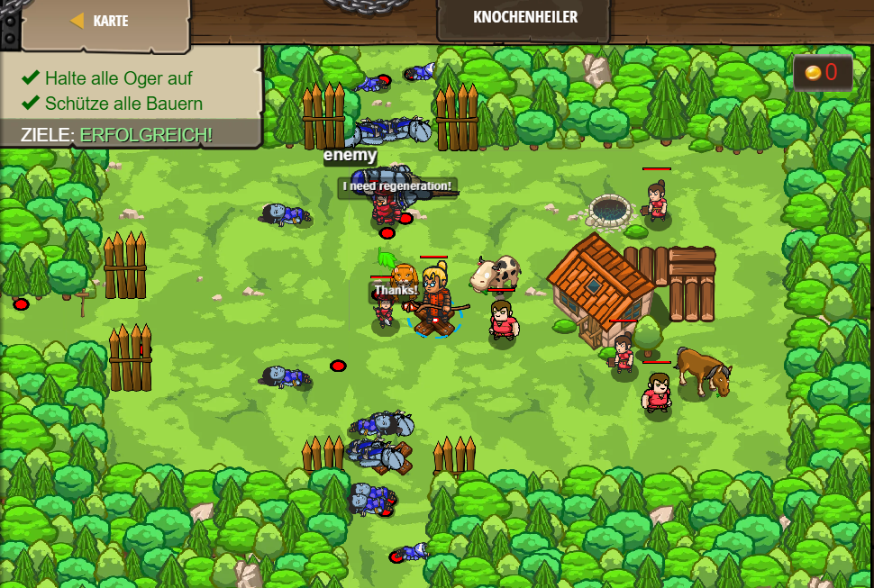

---

## Level 37 Beschützer des Bauern

Im 37 Level kommt nichts neues dazu.

```js
while(true) {
    var enemy = hero.findNearestEnemy();
    var distance = hero.distanceTo(enemy);
    if (distance < 10) {
        hero.attack(enemy);
    }
    else {
        hero.moveXY(40, 40);
    }
}
```
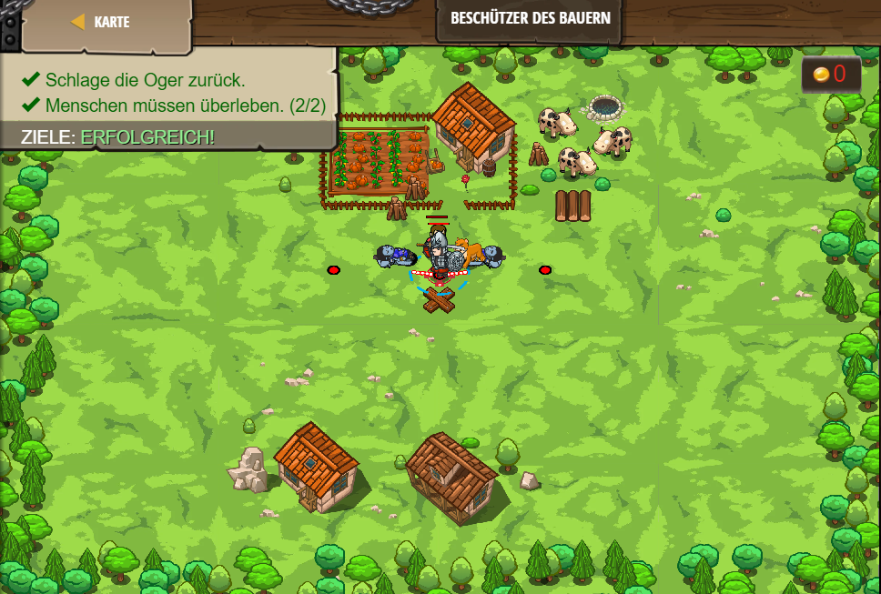

---

## Level 38 Long-Range Division

Im 38. Level kommt nichts neues dazu.

```js
var enemy = hero.findNearestEnemy();
var distanceToEnemy = hero.distanceTo(enemy);
hero.say(distanceToEnemy / 3);
hero.say("Fire!");
hero.say(distanceToEnemy / 1.5);
hero.say("Fire!");

hero.say("Woo hoo!");
hero.say("Here we go!");
hero.say("Charge!!");

while(true) {
    var  enemy = hero.findNearestEnemy();
    hero.attack(enemy);
}
```


---

## Level 39 Munchkinschwarm

Im 39. Level kommt nichts neues dazu.

```js
while(true) {
    var nearestEnemy = hero.findNearestEnemy();
    var distance = hero.distanceTo(nearestEnemy);
    if(distance < 10 ){
    (hero.isReady("cleave"));
    hero.cleave(nearestEnemy);
    }
    else {
        hero.attack("Chest");
    }
}
```


---

## Level 40 Manische Zwerge

Im 40. Level kommt nichts neues dazu.

```js
while(true) {
    var enemy = hero.findNearestEnemy();
    var distance = hero.distanceTo(enemy);
    if(hero.isReady("cleave")) {
        hero.cleave(enemy);
    } else if(distance < 5) {
        hero.attack(enemy)
    } else {
        hero.attack("Chest")
    }
}
```


---

## Level 41 Waldfeuertanz

Im 41. Level lernt man, dass man in eine If-Anweisung noch eine If-Anweisung schreiben kann.

```js
while (true) {
    var evilstone = hero.findNearestItem();
    if (evilstone) {
        var pos = evilstone.pos;
        if (pos.x == 34) {
            hero.moveXY(46, 22);
        } else {
            hero.moveXY(34, 22);
        }
    } else {
        hero.moveXY(40, 22);
    }
}
```


---

## Level 42 Dorfvagabund

Im 42. Level lernt man, wie Funktionen funktionieren.

```js
function findAndAttackEnemy() {
    var enemy = hero.findNearestEnemy();
    if (enemy) {
        hero.attack(enemy);
    }
}

while(true) {
    hero.moveXY(35, 34);
    findAndAttackEnemy();
    hero.moveXY(60, 31);
    findAndAttackEnemy();
}
```


---

## Level 43 Bewegung im Stillstand

Im 43. Level kommt nichts neues dazu.

```js
while(true) {
    var enemy = hero.findNearestEnemy();
    if(enemy) {
        var distance = hero.distanceTo(enemy);
        if(distance < 5) {
            hero.attack(enemy);
        }
        else{ 
            hero.shield();
        }
    } else {
        hero.moveXY(40, 34);
    }
}
```
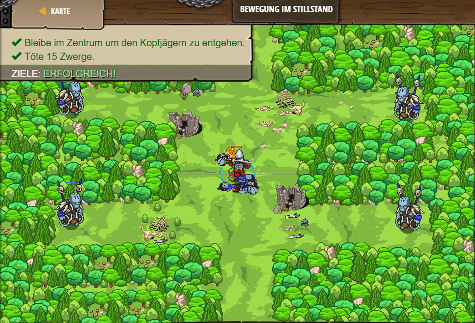

---

## Level 44 Die Agrippa-Verteidigung

Im 44. Level kommt nichts neues dazu.

```js
while(true) {
    var enemy = hero.findNearestEnemy();
    if(enemy) {
        var distance = hero.distanceTo(enemy);
        if(distance < 5) {
            var ready = hero.isReady("cleave");
            hero.cleave(enemy);
        }
            else { 
                hero.attack(enemy);
            }
    }
}
```


---

## Level 45 Village Warder

Im 45. Level kommt nichts neues dazu.

```js
function findAndAttackEnemy() {
    var enemy = hero.findNearestEnemy();
    if (enemy) {
        hero.attack(enemy);
    }
}

function findAndCleaveEnemy() {
    var enemy = hero.findNearestEnemy();
    var ready = hero.isReady("cleave");
    if(hero.isReady("cleave")) {
            hero.cleave(enemy);
            }
}
            
while (true) {
    hero.moveXY(35, 34);
    findAndAttackEnemy();
    findAndCleaveEnemy();
    hero.moveXY(60, 31);
    findAndCleaveEnemy();
        findAndAttackEnemy();
}
```


---

## Level 46 The Agrippa Defense A

Im 46. Level kommt nichts neues dazu.

```js
while(true) {
    var enemy = hero.findNearestEnemy();
    if(enemy) {
        var distance = hero.distanceTo(enemy)
        if(distance < 5 ){
            var ready = hero.isReady("cleave");
            hero.cleave(enemy);
    }
}
}
```


---

## Level 47 Hinterwälder-Gabelung

Im 47. Level kommt nichts neues dazu.

```js
function checkAndAttack(target) {
    if(target) {
        hero.attack(target);
    }
    hero.moveXY(43, 34);
}

while(true) {
    hero.moveXY(58, 52);
    var topEnemy = hero.findNearestEnemy();
    checkAndAttack(topEnemy);    
    hero.moveXY(58, 16);
    var bottomEnemy = hero.findNearestEnemy();
    checkAndAttack(bottomEnemy);
}
```


---

## Level 48 The Agrippa Defense B

Im 48. Level kommt nichts neues dazu.

```js
while(true) {
    var enemy = hero.findNearestEnemy();
    if(enemy) {
        var distance = hero.distanceTo(enemy);
        if(distance < 5) {
            var ready = hero.isReady("cleave");
            hero.cleave(enemy);
            if(false){
            hero.attack(enemy);
            }

}
}
}
```


---

## Level 49 Village Champion

Im 49. Level kommt nichts neues dazu.

```js
function cleaveOrAttack() {
    var ogre = hero.findNearestEnemy();
    if (ogre) {
        if (hero.isReady("cleave")) {
            hero.cleave(ogre);
        }
        else{ 
            hero.attack(ogre);
        }
    }
}

while (true) {
    hero.moveXY(35, 34);
    cleaveOrAttack();
    hero.moveXY(47, 27);
    cleaveOrAttack();
    hero.moveXY(60, 31);
    cleaveOrAttack();
}
```
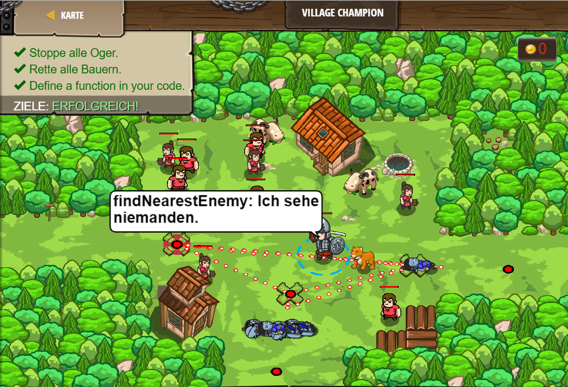

---

## Level 50 Meine feinen Münzen

Im 50. Level kommt nicht neues dazu.

```js
function pickUpCoin() {
    var coin = hero.findNearestItem();
    if(coin) {
        hero.moveXY(coin.pos.x, coin.pos.y);
    }
}
function attackEnemy() {
var enemy = hero.findNearestEnemy()
if(enemy){
    hero.attack(enemy);
}
}
while(true) {
    attackEnemy();
    pickUpCoin();
}
```


---

## Level 51 Tomb Raider

Im 51. Level kommt nichts neues dazu.

```js
function checkToDefend(enemy) {
    if (enemy) {
        hero.attack(enemy);
    }else{
        hero.attack("Door");
    }
}

while(true) {
    var enemy = hero.findNearestEnemy();
    checkToDefend(enemy);
}
```


---

## Level 52 Überlass' es dem Cleaver

Im 52. Level kommt nichts neues dazu.

```js
function cleaveWhenClose(target) {
    if(hero.distanceTo(target) < 5) {
        var ready = hero.isReady("cleave");
        hero.cleave(target);
       } else{ 
            hero.attack(target);
    }
}

while(true) {
    var enemy = hero.findNearestEnemy();
    if(enemy) {
        cleaveWhenClose(enemy);
    }
}
```


---

## Level 53 Tomb Ghost

Im 53. Level kommt nichts neues dazu.

```js
function hitOrHide(target) {
    if(enemy)
        hero.attack(target);
        hero.moveXY(32, 17);
}

while (true) {
    var enemy = hero.findNearestEnemy();
    hitOrHide(enemy);
}
```


---

## Level 54 Mail Interceptor

Im 54. Level kommt nichts neues dazu.

```js
function ambushAttack(target) {
    if(target){
        hero.attack(target);
        hero.moveXY(52, 36);
    }
}

while(true) {
    var ogre = hero.findNearestEnemy();
    ambushAttack(ogre);
}
```


---

## Level 55 Seek-and-Hide

Im 55. Level kommt nichts neues dazu.

```js
function checkTakeHide(item) {
    if (item) {
        hero.moveXY(item.pos.x, item.pos.y);
        hero.moveXY(40, 34);
    }
}

while (true) {
    hero.moveXY(68, 56);
    var lightstone = hero.findNearestItem();
    checkTakeHide(lightstone);
    hero.moveXY(12, 57);
    checkTakeHide();
}
```
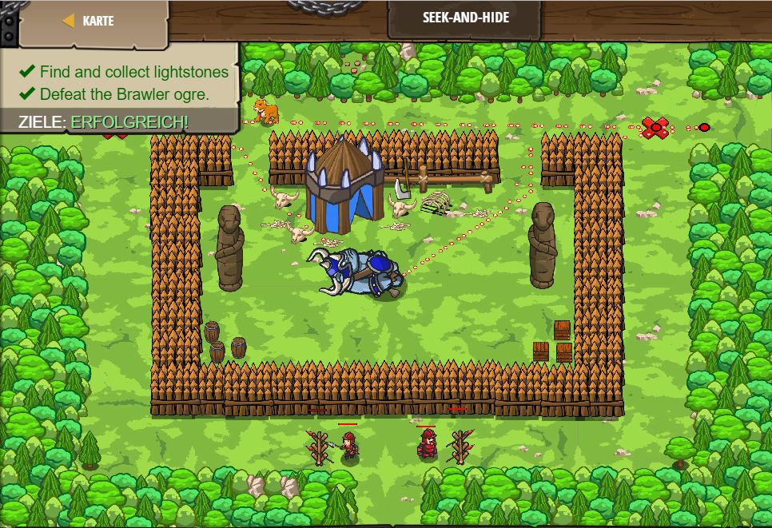

---

## Level 56  Bergarbeiter

Im 56. Level kommt nichts neues dazu.

```js
function checkEnemyOrSafe(target) {
    if(target) {
        hero.attack(target);    
    }else{
        hero.say("l");
}
}
while (true) {
    hero.moveXY(64, 54);
    var enemy1 = hero.findNearestEnemy();
    checkEnemyOrSafe(enemy1);
    
    hero.moveXY(16, 14);
    var enemy2 = hero.findNearestEnemy();
    checkEnemyOrSafe(enemy2);
}
```


---

## Level 57 Short-sighted Burl

Im 57. Level kommt nichts neues dazu.

```js
function takeItem(item) {
    hero.moveXY(item.pos.x, item.pos.y);
}

function checkTakeRun(){
    var item = hero.findNearestItem();
if(item){
    takeItem(item);
    hero.moveXY(40, 12);

}else{
    hero.moveXY(40, 12);

}
}
while (true) {
    hero.moveXY(16, 56);
    var coin = hero.findNearestItem();
    checkTakeRun(coin);
    
    hero.moveXY(64, 56);
    coin = hero.findNearestItem();
    checkTakeRun(coin);
}
```


---

## Level 58 Agrippa Refaktoriert

Im 58. Level kommt nichts neues dazu.

```js
function cleaveOrAttack(enemy) {
if (hero.isReady("cleave")) {
    hero.cleave(enemy);
}else{
    hero.attack(enemy);
}
}

        
while(true) {
    var enemy = hero.findNearestEnemy();
    if(enemy) {
        var distance = hero.distanceTo(enemy);
        if(distance < 5) {
            cleaveOrAttack(enemy);
        }
    }
}
```
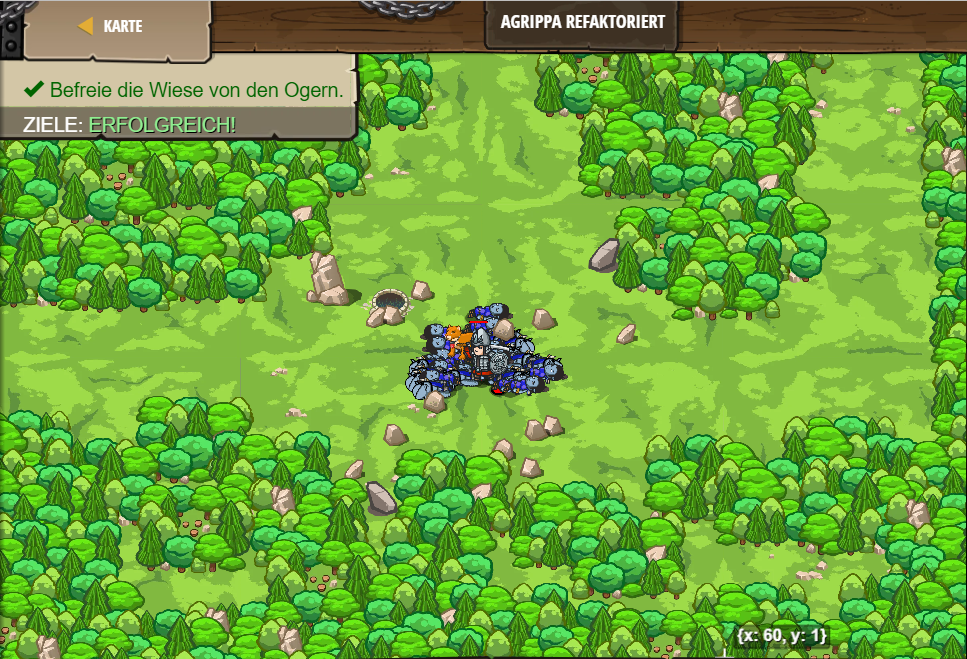

---

## Level 59 Backwoods Ambush A

Im 59. Level kommt nichts neues dazu.

```js
function checkAndAttack(x, y) {
    hero.moveXY(x, y);
    var enemy = hero.findNearestEnemy();
        if(enemy){
        hero.attack(enemy);
}
}
while(true) {
checkAndAttack(24, 42);
checkAndAttack(27, 60);
checkAndAttack(42, 50);
checkAndAttack(39, 24);
checkAndAttack(55, 28);
}
```


---

## Level 60 Hinterwälder-Kumpel

Im 60. Level lernt man, dass man das Haustier sprechen lassen kann. 

```js
function speak(event) {
    pet.say("arrrrhh");
}
pet.on("hear", speak);
hero.say("Hello Kitty");
```


---

## Level 61 Freund und Feind

Im 61. Level teilt man Freunde und Feinde auf und lässt sie gegeeinander kämpfen.

```js

while(true) {
    var friend = hero.findNearestFriend();
    if(friend) {
        hero.say("To battle, " + friend.id + "!");
    }
    var enemy = hero.findNearestEnemy();
    if(enemy)
    hero.say("To battle," + enemy.id + "!");
}
```


---

## Level 62 Agrippas Rückkehr

Im 62. Level lernt man, wenn ein Gegner 5 Meter überschritten hat, wird true zurückgenommmen.

```js
function enemyInRange(enemy) {
    var distance = hero.distanceTo(enemy);
    if(distance < 5 )
    return true;
}

function cleaveOrAttack(enemy) {
    if (hero.isReady("cleave")) {
        hero.cleave(enemy);
    } 
    else {
        hero.attack(enemy);
    }
}

while(true) {
    var enemy = hero.findNearestEnemy();
    if(enemy) {
        if (enemyInRange(enemy)) {
            cleaveOrAttack(enemy);
        }
    }
}
```


---

## Level 63 Holen gehen

Im 63. Level erteilt man seinem Haustier einen Befehl, mit dem Befehl kann dein Haustier die alles holen.

```js
function goFetch() {
    while(true) {
        var potion = hero.findNearestItem();
        if(potion) {
            pet.fetch(potion);
        }
    }
}
pet.on("spawn", goFetch);
```


---

## Level 64 Name des Freundes

Im  64. Level lernt man den Namen seine Haustieres kennen.

```js
function onHear(event) {
    pet.say("Miau Schnurr Miau");
    pet.say("Schnurr Schnurr");
    pet.say("Miau");
    pet.say("Miau");
    pet.say("Miau Schnurr Miau Miau");
}

pet.on("hear", onHear)

hero.say("Was ist dein Name, Kumpel?");
hero.say("Kannst du das wiederholen?");
```


---

## Level 65 Buddy'S Name A

Im 65. Level kommt nichts neues dazu.

```js
function sayName(event) {
    pet.say("My name is Furious Beast.");
    pet.say("But my friends call me Fluffy.");
}
pet.on("hear", sayName)
```


---

## Level 66 PhD-Kitty

Im 66. Level kommt nichts neues dazu.

```js
function sayTwo(event) {
    pet.say("2");
}

pet.on("hear", sayTwo);
hero.say("Eins plus eins ist…?");
hero.say("x^3 - 6x^2 + 12x - 8 = 0. Was ist x...?");
hero.say("Wie viele Monde hat der Mars…?");
```


---

## Level 67 Buddy's Name B

Im 67.Level kommt nichts neues dazu.

```js
function sayHello(event) {
    pet.say("Salutations.");
}
pet.on("hear", sayHello);
hero.say("Hello, my friend!");
```


---

## Level 68 Haustier-Quiz

Im 68. Level kommt nichts neues dazu.

```js
function onHear(event) {
pet.say("yes");
}
pet.on("hear", onHear);
hero.say("Verstehst du mich?");
hero.say("Bist du ein Puma?");
hero.say("Wie alt bist du?");
hero.say("Wie geht es dir");
hero.say("Was machst du heute so")
```


---

## Level 69 Wachhund

Im 69. Level lernt man, dass dein Haustier pet.findNearestEnemy ausführen kann.

```js
function onSpawn(event) {
    while (true) {
        var enemy = pet.findNearestEnemy();
        if(enemy) {
            pet.say("I will eat u");
        }
    }
}

pet.on("spawn", onSpawn);
```


---

## Level 70 Lange Straße

Im 70. Level lernt man, dass dein Hund pet.findNearestItem ausführen kann. Außer dem kann dein Hund dir Gegenstände holen.

```js
function onSpawn(event){
    while(true) {
        
    
    var Potion = hero.findNearestItem();
        if(Potion) {
            pet.fetch(Potion);
        }
    }
}
pet.on("spawn", onSpawn);
hero.moveXY(78, 35);
```


---

## Level 71 Waldjoggen

Im 71. Level lässt man sein Haustier im Kreis laufen und feuert es an.

```js
function onSpawn(event) {
    while(true) {
        pet.moveXY(9, 24);
        pet.moveXY(30, 43);
        pet.moveXY(51, 24);
        pet.moveXY(30, 5);
    }
}

pet.on("spawn", onSpawn);

while(true) {
    hero.say("Guter Hund!");
    hero.say("Du kannst es machen!");
    hero.say("Renn, Renn, Renn!");
    hero.say("Fast!");
    hero.say("Noch eine Runde!");
}
```


---

## Level 72 Luftunterstützung

Im 72. Level

```js
function onSpawn (event) {
    while(true) {
        var item = hero.findNearestItem();
        if(item) {
            pet.fetch(item);
        }
    }
}

pet.on("spawn", onSpawn);

while(true) {
    var enemy = hero.findNearestEnemy();
    if(enemy) {
    hero.attack(enemy);
}
}
```


---

## Level 73 Waldkanonentanz

Im 73. Level lässt man sein Haustier in Intervallen laufen.

```js
function onSpawn (event) {
    while(true) {
    pet.moveXY(48, 8);
    pet.moveXY(12, 8);
    }

}
pet.on("spawn", onSpawn);
while (true) {
    hero.say("Renn!!!");
    hero.say("Schneller!");
}
```


---

## Level 74 Reward and Ruination

Im 74. Level lernt man, wie man die Position eines Gegenstandes mitteilt und darufhin etwas anderes ausführt.

```js
while(true) {
    var enemy = hero.findNearestEnemy();
    if(enemy) {
        var enemyPos = enemy.pos.x + " " + enemy.pos.y;
        hero.say("Enemy at " + enemyPos);
    }
    var item = hero.findNearestItem();
    if(item){
        var itemPos = item.pos.x + " " + item.pos.y;
        hero.say("item at" + itemPos);
    }
}
```


---

## Level 75 Déjà-vu

Im 75.Level lernt man, wie man etwas aufzählt und es dann immer -1 wird also 10, 9, 8... 

```js
var potionsOnTheWall = 10;
var numToTakeDown = 1;
while(true) {
    hero.say(potionsOnTheWall + " potions of health on the wall!");
    hero.say(potionsOnTheWall + " potions of health!");
    hero.say("Take " + numToTakeDown + " down, pass it around");
    potionsOnTheWall-= numToTakeDown;
    hero.say(potionsOnTheWall  + " potions of health on the wall.");
}
```


---

## Level 76 Die Tür der Zauberer

Im 76. Level kommt nichts neues dazu.

```js
hero.moveXY(30, 13);
var las = hero.findNearestFriend().getSecret();

var erz = las + 7;
hero.moveXY(17, 26);
hero.say(erz);

var sim = erz / 4
hero.moveXY(30, 39);
hero.say(sim);
var Aga = sim * 4
hero.moveXY(43, 26);
hero.say(Aga);
```


---

## Level 77 Hinterwäldler Kanonenschütze

Im 77. Level kommt nichts neues dazu.

```js

while(true) {
    var enemy = hero.findNearestEnemy();
    if(enemy) {
        var x = enemy.pos.x;
        var y = enemy.pos.y;
        hero.say(x +"," + y);
    } else {
        hero.say("Cease" + " " + "Fire!");
    }
}
```
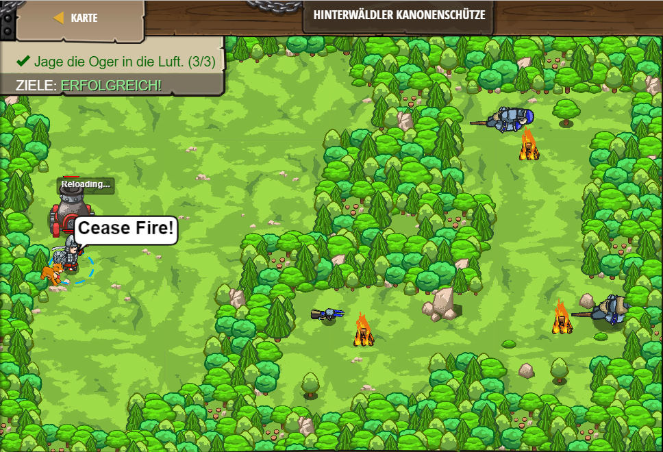

---

## Level 78 Der Zaubertreff

Im 78. Level kommt nichts neues dazu.

```js
hero.moveXY(18, 20);
var zso = hero.findNearestFriend().getSecret();

var mih = zso / 4;
hero.moveXY(30, 15);
hero.say(mih);

var Bea = mih / 5
hero.moveXY(42, 20);
hero.say(Bea);

var San = mih -2
hero.moveXY(38, 37);
hero.say(San);
```


---

## Level 79 Münzenkrümel

Im 79. Level lernt man, wie man Gegenständen folgt.

```js
while (true) {
    var item = hero.findNearestItem();
    if (item) {
        var itemPosition = item.pos;
        var itemX = itemPosition.x;
        var itemY = itemPosition.y;
        hero.moveXY(itemX, itemY);
    }
}
```


---

## Level 80 Die Zauberer-Dimension

Im 80. Level kommt nichts neues dazu.

```js
hero.moveXY(16, 32);
var esz = hero.findNearestFriend().getSecret();

var tam = esz * 3 - 2;
hero.moveXY(24, 28);
hero.say(tam);

var Zso = (tam - 1) * 4 ;
hero.moveXY(32, 24);
hero.say(Zso);

var Ist = (tam + 132) / 2;
hero.moveXY(40, 20);
hero.say(Ist);

var Csi = (tam + 132) *( 132 - 83)
hero.moveXY(48, 16);
hero.say(Csi);
```


---

## Level 81 Weißes-Kaninchen

Im 81. Level kommt nichts neues dazu.

```js
while (true) {
    var item = hero.findNearestItem();
    if (item) {
        // Speichere die Position des Elements in einer neuen Variablen mit Hilfe von item.pos:
        var ItemPositionX = item.pos.x
        var ItemPositionY = item.pos.y
        hero.moveXY(item.pos.x, item.pos.y);
    }
}
```
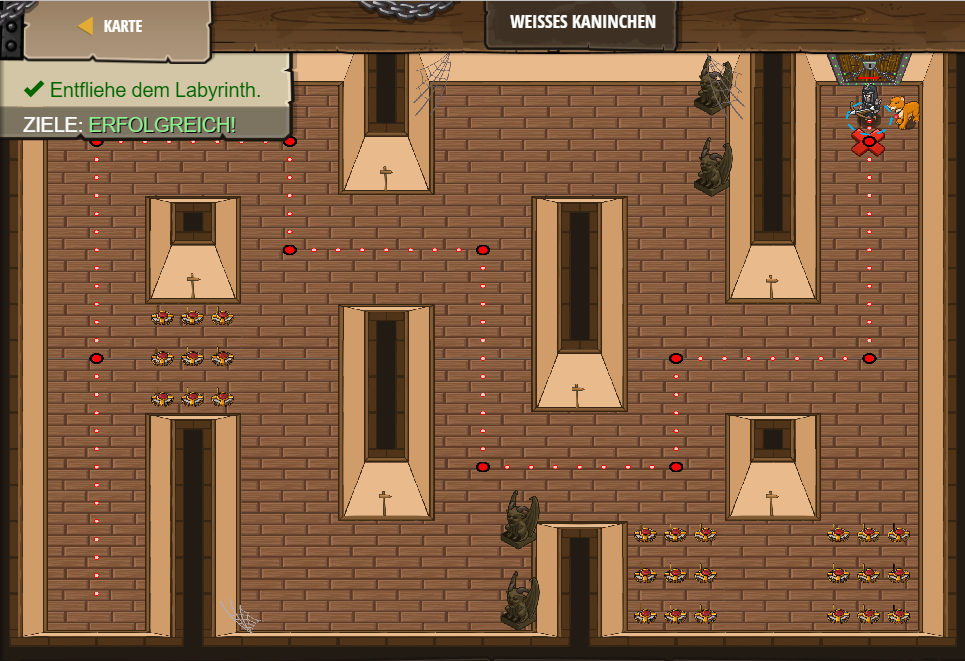

---

## Level 82 Gefährdete Burl

Im 82. Level kommt dazu, dass man Gegner angreift, aber keine Burl.

```js
while(true) {
    var enemy = hero.findNearestEnemy();
    
    if (enemy.type == "burl") {
        hero.say("Ich greife diesen Burl da nicht an!");
    }
    
    if (enemy.type == "munchkin") {
        hero.attack(enemy);
    }
    
    if(enemy.type == "thrower"){ 
    hero.attack(enemy)
    }
    if(enemy.type == "ogre"){
    hero.moveXY(21, 39);
}
}
```


---

## Level 83 Chamäleons

Im 83. Level kommt nichts neues dazu.

```js
while (true) {
    var enemy = hero.findNearestEnemy();
    if(enemy) {
        hero.attack(enemy);
    }
    var item = hero.findNearestItem();
    if(item) {
    var itemPositionX = item.pos.x
    var itemPositionY = item.pos.y
    hero.moveXY(item.pos.x, item.pos.y);
    }
}
```


---

## Level 84 Kugel(Pfeil)sicherer Wolf

Im 84. Level lernt man, dass dein Wolf Pfeile anfangen kann und dich beschützt.

```js
hero.moveXY(12, 34);
hero.say("wake up");
while(true) {
var item = hero.findNearestItem()
if(item) {
    var itemPositionX = item.pos.x
    var itemPositionY = item.pos.y
    hero.moveXY(item.pos.x, item.pos.y);
    
}
}
```


---

## Level 85 Blinder Abstand

Im 85. Level lernt man, wenn kein Gegner in der Nähe ist, wird die Funktion zurück gesetllt.

```js
function nearestEnemyDistance() {
    var enemy = hero.findNearestEnemy();
    var result = 0;
    if (enemy) {
        result = hero.distanceTo(enemy);
    }
    return result;
}

while (true) {
    nearestEnemyDistance();
    var Distance = nearestEnemyDistance();
    if(Distance > 0 ) {
        hero.say(Distance);
    }
}
```


---

## Level 86 Taunting

Im 86. Level kommt nichts neues dazu.

```js
function dealEnemy(enemy) {
    if (enemy.type == "munchkin") {
        hero.attack(enemy);}
    if(enemy.type == "brawler") {
        hero.say("hi brawler, how are you");
    }
}

while (true) {
    var enemy = hero.findNearestEnemy();
    if (enemy) {
        dealEnemy(enemy);
    }
    else {
        hero.moveXY(30, 34);
    }
}
```


---

## Level 87 Hit and Freeze

Im 87. Level kommt nichts neues dazu.

```js
function inAttackRange(enemy) {
    var distance = hero.distanceTo(enemy);
    if (distance <= 3) {
        return true;
    } else {
        return false;
    }
}

while (true) {
    var enemy = hero.findNearestEnemy();
var canAttack = inAttackRange(enemy);
    if(canAttack) {
        hero.attack(enemy);
}
}
```


---

## Level 88 Münzjäger

Im 88. Level kommt nichts neues dazu.

```js
function isCoinClose(coin) {
    var distance = hero.distanceTo(coin);
    if(distance < 20) {
        return true
    }else{
        return false
}
}

while (true) {
    var item = hero.findNearestItem();
    if (item) {
        if (isCoinClose(item)) {
            hero.moveXY(item.pos.x, item.pos.y);
        }
    }
}
```


---

## Level 89 Versalzene Erde

Im 89. Level kommt nicht neues dazu.

```js
while(true) {
    var enemy = hero.findNearestEnemy();
    if(enemy.type == "munchkin" || enemy.type == "thrower") {
        hero.attack(enemy);
    }
    var item = hero.findNearestItem();
    if (item.type == "coin") {
    var pos = item.pos
    var x = pos.x
    var y = pos.y
    hero.moveXY(x, y);
}
}
```


---

## Level 90 Metal Detector

Im 90. Level kommt nichts neues dazu.

```js
function coinDistance() {
    var coin =  hero.findNearestItem();
    if(coin) {
        return hero.distanceTo(coin);
    }else{
        return 0
}
}
while (true) {
    var distance = coinDistance();
    if (distance > 0) {
        hero.say(distance);
    }
}
```


---

## Level 91 Sternenschauer

Im 91. Level kommt nichts neues dazu.

```js
while (true) {
    var item = hero.findNearestItem();
    var distance = hero.distanceTo(item);
    if (item.type== "gem" || distance<20) { 
    hero.moveXY(item.pos.x, item.pos.y);  
}
}
```


---

## Level 92 Frühlingsdonner

Im 92. Level lernt man, wenn das Value so uns so größ ist, wird der Gegenstand eingesammelt.

```js
while (true) {
    var item = hero.findNearestItem();
    if (item.type == "coin" && item.value == 2) {
        hero.moveXY(item.pos.x, item.pos.y);
    }
    if(item.type == "gem" && item.value == 10) {
        hero.moveXY(item.pos.x, item.pos.y);
}
}
```


---

## Level 93 Forest Shadow

Im 93. Level kommt nichts neues dazu.

```js
while (true) {
    var enemy = hero.findNearestEnemy();
    if(enemy.type == "thrower" || enemy.type == "munchkin") {
        hero.attack(enemy);
    }
    var item = hero.findNearestItem();
    if(item.type == "gem" || item.type == "coin") {
        hero.moveXY(item.pos.x, item.pos.y);
    }
}
```


---

## Level 94 Teleport Lasso

Im 94. Level kommt nichts neues dazu.

```js
while (true) {
    var enemy = hero.findNearestEnemy();
    var distance = hero.distanceTo(enemy);
    if(enemy.type == "munchkin") {
        hero.attack(enemy);
    }
}
```
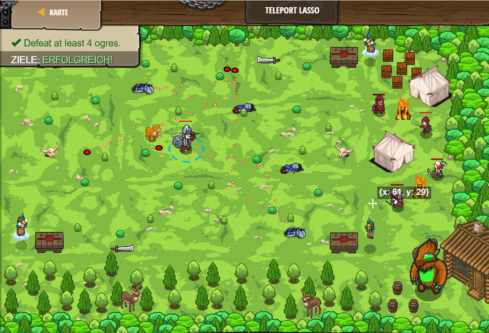

---

## Level 95 Gewöhnlicher Tag

Im 95. Level kommt nichts neues dazu.

```js
while (true) {
    var enemy = hero.findNearestEnemy();
    if (enemy && enemy.type == "munchkin") {
        hero.attack(enemy);
    }
    var item = hero.findNearestItem();
    if(item && item.type == "coin") {
        hero.moveXY(item.pos.x, item.pos.y);
}
}
```


---

## Level 96 Jagt auf die Brawler

Im 96. Level kommt nichts neues dazu.

```js

while (true) {
    var enemy = hero.findNearestEnemy();
    var distance = hero.distanceTo(enemy);
    if(enemy && enemy.type == "brawler" && distance < 50) {
        hero.say("Fire!")
}
}
```


---

## Level 97 Auf der Durchreise

Im 97. Level kommt nichts neues dazu.

```js
while(true) {
    var item = hero.findNearestItem();
    if(item) {
        if(item.type != "gem") {
            hero.moveXY(pet.pos.x, pet.pos.y);
        }
        else{
            hero.moveXY(item.pos.x, item.pos.y);
        }
    }
}
```


---

## Level 98 Wonderglade

Im 98. Level kommt nichts neues dazu.

```js
while (true) {
    var item = hero.findNearestItem();
    if (item) {
        if(item.type != "gem"){
            hero.moveXY(item.pos.x, item.pos.y);
        }
    }
}
```


---

## Level 99 Logischer Pfad

Im 99. Level lernt man, mit secrets zu arbeiten und wenn etwas true oder false ist wird das nicht gemacaht oder gemacht.

```js

hero.moveXY(14, 24);
var secretA = hero.findNearestFriend().getSecretA();
var secretB = hero.findNearestFriend().getSecretB();

var secretC = secretA && secretB;
if (secretC){
    hero.moveXY(20, 33);
}
else{
    hero.moveXY(20, 15);
}
hero.moveXY(26, 24);

if(secretA===true || secretB===true) {
hero.moveXY(32, 33);
}
if(secretB!==true){
    hero.moveXY(44, 33);
}
else{
    hero.moveXY(44, 16);
}
hero.moveXY(50, 24);
```


---

## Level 100 Nützliche Konkurrenten

Im 100. Level kommt nicht neues dazu.

```js
while(true) {
    var enemy = hero.findNearestEnemy();
    if(enemy) {
        if(enemy.type != "peon") {
            hero.attack(enemy);
        }
    }
    var item = hero.findNearestItem();
    if(item) {
        if(item.type !=="poison"){
            hero.moveXY(item.pos.x, item.pos.y);
        }
    }
}
```
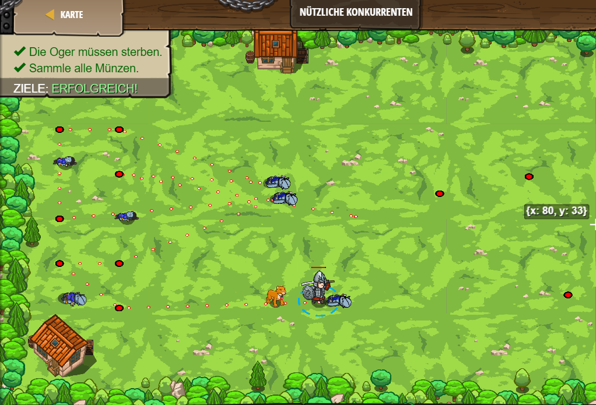

---

## Level 101 Burlbole Grove

Im 101. Level kommt nichts neues dazu.

```js
function shouldAttack(target) {
    if(!target) {
        return false}
if(enemy.type == "burl"){
    return false}
    return true;
}

while(true) {
    var enemy = hero.findNearestEnemy();
    var heroShouldAttack = shouldAttack(enemy);
    if(heroShouldAttack) {
        hero.attack(enemy);
    }
}
```


---

## Level 102 Cursed Wonderglade

Im 102. Level kommt nichts neues dazu.

```js
while (true) {
    var item = hero.findNearestItem();
    if(item){
        if(item.type != "gem") {
            hero.moveXY(item.pos.x, item.pos.y)
        }
    }
    var enemy = hero.findNearestEnemy();
    if(enemy.type != "burl"){
        hero.attack(enemy);
    }
}
```


---

## Level 103 Logischer Kreis

Im 103. Level kommt nichts neues dazu.

```js
hero.moveXY(20, 24);
var secretA = hero.findNearestFriend().getSecretA();
var secretB = hero.findNearestFriend().getSecretB();
var secretC = hero.findNearestFriend().getSecretC();

var secretD = secretA && secretB && secretC;
if (secretD){
    hero.moveXY(30, 33);
}
else{
    hero.moveXY(30, 15);
}

var secretE = secretA | secretB | secretC
if(secretE){
    hero.moveXY(20, 24);
}else{
    hero.moveXY(40, 24);
}

var secretF = secretA && secretB && secretC && secretD && secretE
if(secretF) {
    hero.moveXY(30, 33);
}else{
    hero.moveXY(30, 15);
}
```


---

## Level 104 Rückkehr zur Dornenbusch Farm

Im 104. Level kommt nichts neues dazu.

```js
function maybeBuildTrap(x, y) {
    hero.moveXY(x, y);
    var enemy = hero.findNearestEnemy();
    if(enemy) {
        hero.buildXY("fire-trap", x, y);
    }
}

while(true) {
    maybeBuildTrap(43, 50);
    
     maybeBuildTrap(25, 34);

     maybeBuildTrap(43, 20);
}
```


---

## Level 105 Logischer Schluss

Im 105. Level kommt nichts neues dazu.

```js
hero.moveXY(24, 16);
var secretA = hero.findNearestFriend().getSecretA();
var secretB = hero.findNearestFriend().getSecretB();
var secretC = hero.findNearestFriend().getSecretC();

var tam = (secretA && secretB) || secretC;
hero.moveXY(19, 26);
hero.say(tam);

var zso = (secretA || secretB) && secretC 
hero.moveXY(26, 36);
hero.say(zso);

var ist = (secretA || secretC) && (secretB || secretC)
hero.moveXY(37, 34);
hero.say(ist);

var csi = (secretA && secretB) ||  (secretB) && (secretC)
hero.moveXY(40, 22);
hero.say(csi);

```


---

## Level 106 Return to Thornbush Farm A

Im 106. Level kommt nichts neues dazu.

```js
function maybeBuildTrap(x, y) {
    hero.moveXY(x, y);
    var enemy = hero.findNearestEnemy();
    if(enemy) {
        hero.buildXY("fire-trap", x, y);
    }
}

while(true) {
    maybeBuildTrap(20, 34);
    maybeBuildTrap(38, 20); 
    maybeBuildTrap(56, 34);
}    
```


---

## Level 107 Geschlossene Starßenkreuzung

Im 107. Level 

```js
function maybeBuildSomething(typeToBuild, x, y) {
    hero.moveXY(x, y);
    var enemy = hero.findNearestEnemy();
    if(enemy){
         hero.buildXY(typeToBuild, x, y);
}
}
while(true) {
    maybeBuildSomething("fire-trap", 40, 20);
    maybeBuildSomething("fence", 26, 34);
    maybeBuildSomething("fire-trap", 40, 50);
    maybeBuildSomething("fence", 54, 34);
}
```


---

## Level 108 Coinucopia

Im 108. Level lernt man, dass man Flaggen platzieren kann und dein Held dann hinterher läuft.

```js
while(true) {
    var flag = hero.findFlag();
    if (flag) {
        hero.pickUpFlag(flag);
    }
    else {
        hero.say("Platziere die Flagge für mich, um mir den Weg zu weisen.");
    }
}
```


---

## Level 109 Return to Thornbush Farm B

Im 109. Level kommt nichts neues dazu.

```js
function maybeBuildTrap(x, y) {
    hero.moveXY(x, y);
    var enemy = hero.findNearestEnemy();
    if(enemy) {
        hero.buildXY("fire-trap", x, y);
    }
}

while(true) {
    maybeBuildTrap(38, 20);
    maybeBuildTrap(56, 34);
    maybeBuildTrap(38, 48);
}    
```


---

## Level 110 Gier-Fallen

Im 110. Level kommt nichst neues dazu.

```js
function maybeBuildTrap(x, y) {
    hero.moveXY(x, y);
    var item = hero.findNearestItem();
    if(item){
        hero.buildXY("fire-trap", x, y);
    }
    
}
while (true) {
    maybeBuildTrap(12, 56);
    maybeBuildTrap(68, 56);
    maybeBuildTrap(68, 12);
    maybeBuildTrap(12, 12);
}
```


---

## Level 111 Kupferrwisen

Im 111. Level kommt nichts neues dazu.

```js
while(true) {
    var flag = hero.findFlag();
    if (flag) {
        hero.pickUpFlag(flag);
    } else {
        var item = hero.findNearestItem();
        if (item) {
            var position = item.pos;
            var x = position.x;
            var y = position.y;
            hero.moveXY(x, y);
        }
    }
}
```


---

## Level 112 Sicherer Abstand

Im 112. Level kommt nichts neues dazu.

```js
while (true){
    var item = hero.findNearestItem();
     if (item){
    if(hero.distanceTo(item) < 15 ) {      
        hero.moveXY(item.pos.x,item.pos.y);
        hero.moveXY(42, 45);
    }
    }
}
```


---

## Level 113 Lass die Flagge fallen

Im 113. Level kommt nichts neues dazu.

```js
while(true) {
    var flag = hero.findFlag();
    if (flag) {
        hero.moveXY(flag.pos.x, flag.pos.y);
        
        hero.buildXY("fire-trap", flag.pos.x, flag.pos.y);
        hero.pickUpFlag(flag);
    }
    else {
        var item = hero.findNearestItem();
        if (item) {
            var itemPos = item.pos;
            var itemX = itemPos.x;
            var itemY = itemPos.y;
            hero.moveXY(itemX, itemY);
        }
    }
}
```


---

## Level 114 Tödliche verfolgung

Im 114. Level kommt nichts neues dazu.

```js
while(true) {
    var flag = hero.findFlag();
    var item = hero.findNearestItem();
    if (flag) {
        hero.buildXY("fire-trap", flag.pos.x, flag.pos.y);
        hero.pickUpFlag(flag);
    }
    else if (item) {
    hero.moveXY(item.pos.x, item.pos.y);    
        
    }
}
```


---

## Level 115 Denke an die Fallen

Im 115. Level kommt nichts neues dazu.

```js
while(true) {
    var flag = hero.findFlag();
    var enemy = hero.findNearestEnemy();
    
    if(flag) {
        var flag = hero.findFlag();
        hero.pickUpFlag(flag);
        hero.say("Ich sollte die Flagge holen.");
    } else if(enemy) {
    var distance = hero.distanceTo(enemy);
    if(distance < 10 ) {
        hero.attack(enemy);
    }
}
}
```


---

## Level 116 Signalleiche

Im 116. Level kommt nichts neues dazu.

```js
while(true) {
    var green = hero.findFlag("green");
    var black = hero.findFlag("black");
    var enemy = hero.findNearestEnemy();
    
    if (green) {
        hero.pickUpFlag(green);
    } else if (black && hero.isReady("cleave")) {
        hero.pickUpFlag(black);
        hero.cleave(enemy);
    } else if (enemy && hero.distanceTo(enemy) < 10) {
        hero.attack(enemy);
    }
}
```


---

## Level 117 Halte den Waldpass

Im 117. Level kommt nichts neues dazu.

```js
while(true) {
    var enemy = hero.findNearestEnemy();
    var flag = hero.findFlag();
    if(flag) {
        hero.pickUpFlag(flag);
    } else if (enemy) {
        hero.attack(enemy);
    }
}
```


---

## Level 118 Reicher Wildhüter

Im 118. Level kommt nichts neues dazu.

```js
while(true) {
    var flag = hero.findFlag();
    var enemy = hero.findNearestEnemy();
    var item = hero.findNearestItem();

    if (flag) {
        hero.moveXY(flag.pos.x, flag.pos.y);
        hero.pickUpFlag(flag);
    }
    else if (enemy) {
        hero.attack(enemy);
    }
    else if (item) {
        hero.moveXY(item.pos.x, item.pos.y);
    }
}
```


---

## Level 119 Multiplayer Schatzwald

Im 119. Level kommt nichts neues dazu.

```js
while(true) {
    var flag = hero.findFlag();
    if(flag) {
        hero.moveXY(flag.pos.x, flag.pos.y);
        hero.pickUpFlag(flag);
    }
    var item = hero.findNearestItem();
    if(item) {
        hero.moveXY(item.pos.x, item.pos.y);
    }
    else{ 
        var enemy = hero.findNearestEnemy();
        hero.attack(enemy);
    
}
}
```


---

## Level 120 Hinterwaldrauferei

Im 120. Level kommt nichts neues dazu.

```js
while(true) {
var enemy = hero.findNearestEnemy();
if(enemy){
    hero.attack(enemy);
}
}

```


---