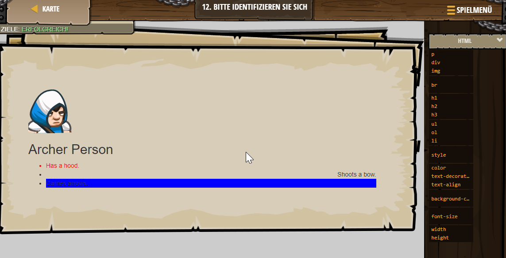

# Web-Entwickelung

## Level 1 Erster Anfang

Im 1. Level lernt man, wie man was zu einer Seite hinzufügt.

Bearbeite mich!
Hallo


---

## Level 2 Aufbruch zum Umbruch

Im 2. Level lernt man, wie man einen <br> Tag benutzt.

```js
<br>
<!-- Für eine Zeile tiefer einen <br>-Tag hinzu: -->
<br>
Ich sollte in meiner eigenen Textzeile stehen, nicht direkt hinter einem anderen Satz!
<!-- Füge eine Zeile tiefer noch ein <br> hinzu und schreibe noch eine Zeile Text dazu: -->
<br>
E
```


---

## Level 3 Paragraph Paragon

Im 3. Level lern man, wie man einen <br> und einen <p> Tag verrwendet.

```js
<p>HTML tags can be on the same line, or...</p>
<p>
    ... on different lines! Just make sure the opening and closing tags exist.
</p>
<!-- Add a <p> tag below: -->
<p>
    This should be a paragraph. Surround me!
<!-- Add a </p> tag below: -->
</p>
<!-- Finally add a <p> and </p> with text between. -->
<p> ... </p>
```


---

## Level 4 Überschriften

Im 4 Level lernt man, wie man Überschriften und Unterüberschriften macht.

```js
<h1>[Was?]</h1> <!-- ∆ Ändere diese Zeile zu einem beliebigen Inhalt. -->
<h2>Ogreball</h2>
<!-- Füge eine andere <h2> Markierung hinzu mit dem Namen einer Sportart!  -->
<h2>Handball</h2>
```


---

## Level 5 Illustrious Imagery

Im 5. Level lernt man, wie man Bilder in eine Website macht.

```js
<h1>My Frend</h1>
 <!-- ∆ Change this src! -->
<!-- Add 2 more images to fill up the page! -->

```


---

## Level 6 Unterteile und herrsche

Im 6. Level lernt man, wie man <div> benutz.

```js
<div>
    <h2> wefibwuff</h2>
    <p>uergehrgegeege
<div>
    <h2> erghioeöroighorh </h2>
    <p>ghergbkergkegbekerghe </p>
```


---

## Level 7 Listing Liaison

Im 7. Level lernt man, wie man Listen erstellt.

```js
<h1>Lists of Animals</h1>
<h2>Animals With Wings</h2>
<ul>
    <li>Bees</li>
    <li>Flying Antelopes</li>
    <li>Pterodactyl</li>
    <!-- Add another animal inside a <li> tag. -->
     <li>Bird</li>
</ul>
<!--  Add another <h2> tag to define a new list -->
<h2>Animals</h2>
<!-- Add a <ul> tag to group <li> elements. -->
<ul>
    <!-- Add 3 or more <li> tags with names of animals! -->
    <li>Rabbit</li>
    <li>Cat</li>
    <li>Lion</li>
</ul>
```


---

## Level 8 Stylish Intent

Im 8. Level lernt man, wie man ein Newspaper erstellt. Also man lernt mit Codes die Schrift zu zentrieren...

```js
<h1>The News</h1> <!-- Name the newspaper. -->
<h6>Kithgard edition.</h6>
<style>
    h6 {
        text-align: center;
    }
    h1 {
        color: red;
        text-decoration: underline;
        /* Align to center using the text-align: */
        text-align:center;
    }
    p {
        color: blue;
        text-align:center;
        /* Give all paragraph text a color: */
        /* Colors can be purple, orange, blue, etc! */
        
    }
</style>
```


---

## Level 9 Gross und hoch

Im 9. Level lernt man, wie man die Größe von Bildern anpasst.

```js

<!-- Dieses Bild wird auf die Größe 200x100 gezwungen! -->

<!-- Füge ein weiteres  Tag hinzu und benutze Höhe oder Breite: -->

```


---

## Level 10 Orders Wanted

Im 10. Level man lernt eine Liste mit Unterpunkten zu machen.

```js
<h1>Top 4 Most Wanted</h1>
<h2>Enemies</h2>
<ol>
    <li>Headhunter Paul</li>
    <li>Munchkin #41</li>
    <li>Cow</li>
    <!-- Add another enemy here: -->
    <li>Cat</li>
</ol>
<h1>Animals that life in the water</h1>
<!-- Add another <h2> for Friends:  -->
<h2>Animals</h2>
<!-- Add a new <ol> to contain those friends: -->
<ol>
    <!-- Add 3 or more <li> elements inside the <ol>: -->
    <li>squid</li>
    <li>perch</li>
    <li>goldfish</li>
```


---

## Level 11 Classy

Im 11. Level lernt man einem Bild eine Hintergrundfarbe zu geben.

```js
<style>
    /* The "." tells CSS to target a "class" name. */
    .character {
        background-color:orange;
    }
</style>

<div>
    <h1>Romeogre and Juliet</h1>
    <h2>The Cast</h2>
</div>
<!-- The class attribute has been added to these <div> -->
<div class="character">
    
    <h3>Cindy Archer</h3>
    <p>as Juliet</p>
</div>
<!-- Include the main star Romeogre! -->
<!-- Add another <div> with the "character" class: -->
<style>
    .character {
         background-color:orange;
}

</style>
<div class="character">
    
<h3>Harry Archer</h3>
<p>as Romeogre</p>
```


---

## Level 12 Bitte Indentifizieren Sie sich

Im 12. Level lernt man, wie man die Farbe vom Text ändert und neue Elemente hinzufügt.

```js
<style>
    /* Das "#" wird benutzt, um eine "id" anzusprechen. */
    #element1 {
        color:red;
    }
    #element2 {
        /* Ändere die Ausrichtung (text-align) des Textes.  */
        text-align:right;
    }
    /* Füge eine Regel für #element3 hinzu */
    #element3 {
   background-color:blue;
    }   
        /* Verändere die Hintergrundfarbe von #element3 */
    
</style>
<div class="descriptive">
    
    <h2>Archer Person</h2>
    <ul>
        <li id="element1">Has a hood.</li>
        <li id="element2">Shoots a bow.</li>
        <li id="element3">Carries arrows.</li>
    </ul>
</div>
```


---

## Level 13 Wanted Poster

Im 13. Level lernt man, wie man ein Wanted Poster erstellt und wie man alles perfekt anpasst.

```js
<style>
    h1 {
        color: red;
    }
    h1 {
        font-size: 7em;
    }
    h2 {
        /* Change the number to change the size of the header text. */
        font-size: 3em;
    }
    h3 {
        font-size: 1.5em;
    }
    li {
        font-size:1.5em;
    }
</style>
<h1>Wanted</h1>

<!-- Find an image from the Image Gallery above, or use your own image link -->


<!-- Who is wanted? -->
<h2>Harry Archer</h2>

<!-- What are they wanted for? -->
<h3>For Reckless, Inhuman Crimes:</h3>
<ul>
    <li>Crime 1</li>
    <li>Crime 2</li>
    <li>crime 3</li>
    <li>crime 4</li>
</ul>

<!-- What is the reward? -->
<h2>Reward: 100000$</h2>

<!-- Who are their partners in crime? -->
<h3>Known Accomplices</h3>
<div>
    <div>
        
        <h3>Maja Archer</h3>
    </div>
    
    <div>
        
        <h3>Samy smith</h3>
    </div>
    
    <!-- Add a third accomplice here. Choose whether they are class "captured". -->
    <div>
    
    <h3>Ludwig Ogre</h3>
</div>

<!-- How do want them captured? -->
<h2>Capture Alive Only</h2>
```


