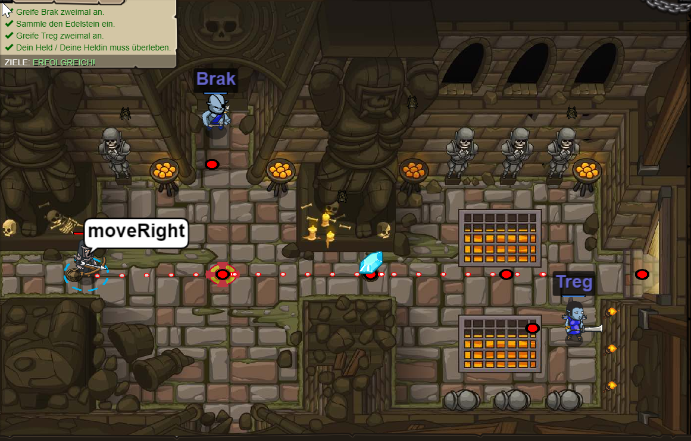
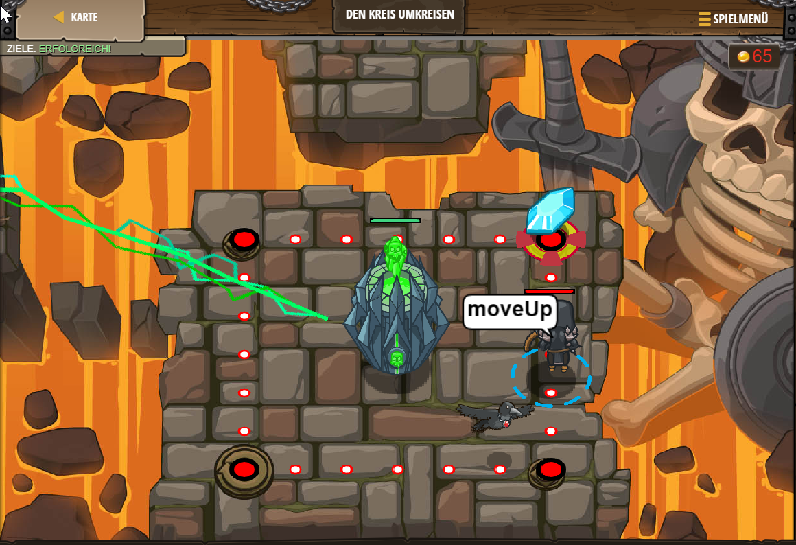
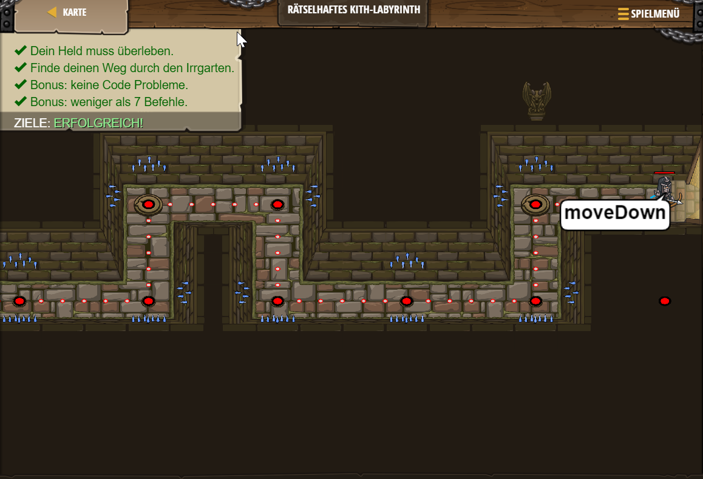
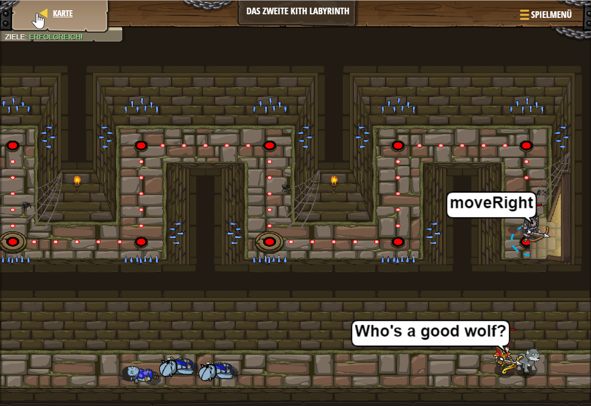
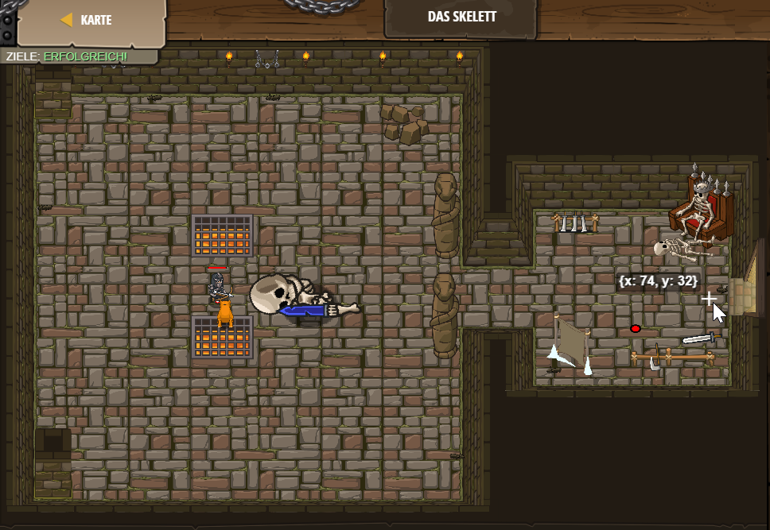
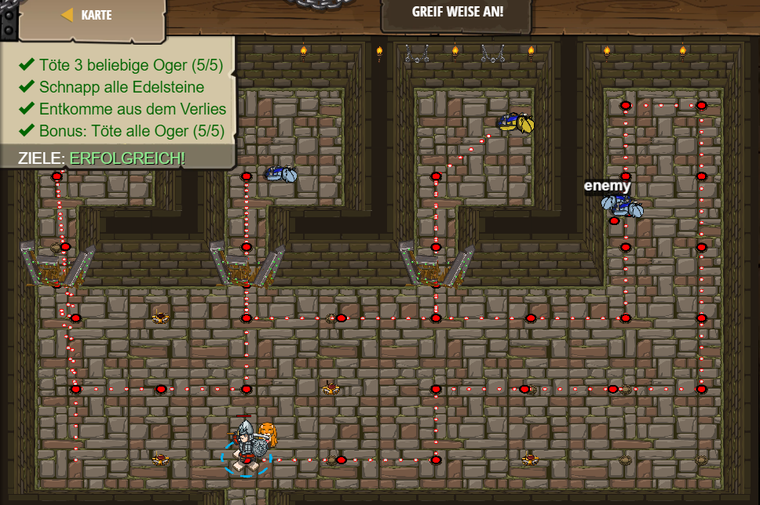
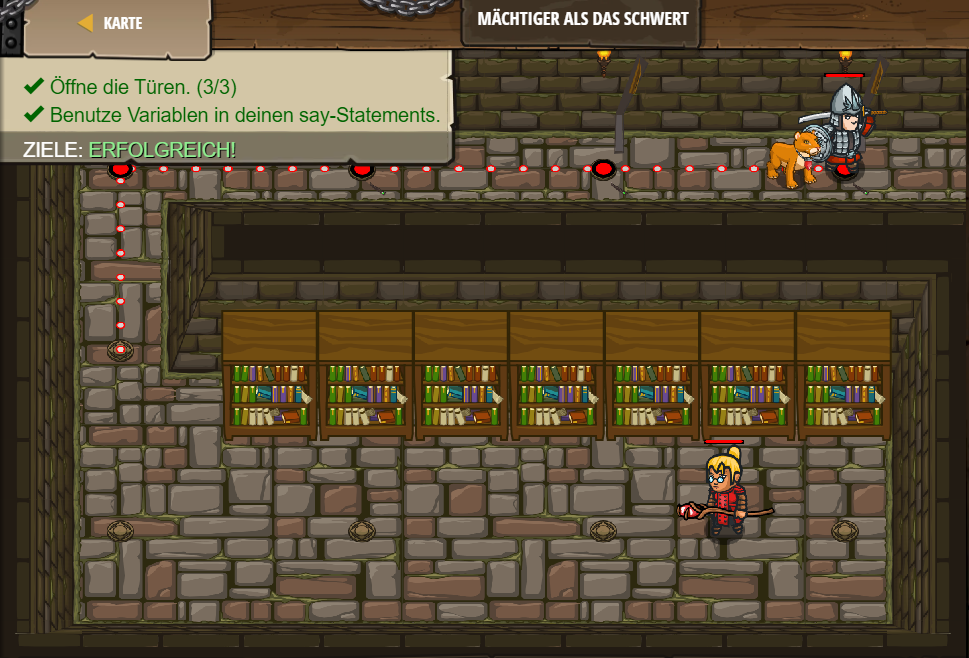

# Codecombat


---
## Level 1 Verlies von Kithgard

Im 1. Level muss man die Codes *hero.moveRigth/Left/Up/Down* kennen, um sich mit der Spielfigur zu bewegen.

```js
hero.moveRight();
hero.moveDown();
hero.moveRight(); 
```


---

## Level 2 Edelsteine  in der Tiefe
Im 2. Level kommt nichts Weiteres dazu.

```js
hero.moveRight();
hero.moveDown();
hero.moveUp();
hero.moveUp(); 
hero.moveRight();
```


---
## Level 3 Der Schattenwächter

Im 3. Level kommt nichts neues dazu.

```js
hero.moveRight();
hero.moveUp();
hero.moveRight();
hero.moveDown();
hero.moveRight();
```


---
## Level 4 Vergesslicher Edelsteinschmied

Im 4. Level kommt nichts neues dazu.

```js
hero.moveRight();
hero.moveDown();
hero.moveRight();
hero.moveRight();
hero.moveUp();
hero.moveRight();
```


---
## Level 5 Wahre Namen

Im 5. Level wird einem erklärt, wie man die Gegner angreift. Man braucht den Code hero.attack("Name");

```js
hero.moveRight();
hero.attack("Brak");
hero.attack("Brak");
hero.moveRight();
hero.attack("Treg");
hero.attack("Treg");
```


---
## Level 6 Gegen den Ogerzeigersinn

Im 6. Level lernt man, dass man in die Klammer eine Zahl nvon 1-4 einsetzen kann und somit kannst du mit 1-4 in die jeweilige Richtung mit deier Figur vorrücken.

```js
hero.moveDown(2);
hero.moveRight();
hero.moveUp(); 
hero.moveRight();
```


---

## Level 7 Schleichwege von Kithgard

Im 7. Level kommt nichts neues  dazu.

```js
hero.moveRight();
hero.moveLeft();
hero.moveRight(2);
```


---
## Level 8 Feindliche Mine

Im 8. Level kommt nichts neues dazu.

```js
hero.moveRight(3);
hero.moveUp();
hero.moveRight();
hero.moveDown(3);
hero.moveRight(3);
```


---

## Level 9 Scheinbare Störung

Im 9. Level kommt nichts neues dazu.

```js
hero.moveRight();
hero.moveDown(2);
hero.moveUp(2);
hero.moveRight(3);
```


---

## Level 10 Günstige Chancen

Im 10. Level kommt nichts neues dazu.

```js
hero.moveRight();
hero.attack("Krug");
hero.attack("Krug");
hero.moveRight();
hero.moveUp();
hero.attack("Grump");
hero.attack("Grump");
hero.moveLeft(2);
```


---

## Level 11 Auf Arbeit schlafen

Im 11. muss man üben, die schlafenden Gegner anzugreifen. Sonst kommt nichts neues dazu.

```js
hero.moveUp();
hero.moveRight(2);
hero.attack("Bas");
hero.attack("Bas");
hero.attack("Vera");
hero.attack("Vera");
hero.moveRight();
```


---
## Level 12 Zellenkommentar

Im 12. Level muss man eine Tür mit Hilfe eines Passwort hero.say("Name") aufmachen.

```js
hero.say("Wie lautet das Passwort?");
Das Passwort ist: "Achoo"
hero.say("Achoo");
hero.moveUp(2);
```


---

## Level 13 Bibliothekar Kithgards

Im 13. Level muss man wider eine  Tür mit einem Zauberspruch öffnen.
Dieser steht in den Tipps, wo vorher draufhin gewiesen wurde.

```js
hero.say("Hush");
hero.moveRight(2);
```


---

## Level 14 Das erhobene Schwert

Im 14. Level muss man gegen 3 Gegner kämpfen, es kommt nichts neues dazu.

```js
hero.attack("Rig");
hero.attack("Rig");
hero.attack("Gurt");
hero.attack("Gurt");
hero.attack("Ack");
hero.attack("Ack");
```


---
## Level 15 Der Gefangene

Im 15. Level muss man eine Tür aufbrechen, dafür benutzt man hero.attck("Name").

```js
hero.moveRight();
hero.attack("Weak Door")
hero.moveRight(3);
hero.moveDown(1);
hero.attack("Two")
hero.attack("Two")
hero.attack("Two")
hero.attack("Two")
hero.attack("Two")
hero.attack("Two")
hero.moveDown(2);
```


---

## Level 16 Feuer des Verderbens

Im 16. Level kommt nichts neues dazu, außer dass man gegen einen stärkeren Gegner kämpft.

```js
hero.moveRight();
hero.moveUp();
hero.attack("Grumus")
hero.attack("Grumus")
hero.attack("Grumus")
hero.moveDown();
hero.attack("Grumus")
hero.attack("Grumus")
hero.moveRight();
hero.moveUp();
hero.moveRight();
```


---

## Level 17 Feuertanz

Im 17. Level lernt man eine Endlosschleife zu erstellen.

```js
while(true) {
    hero.moveRight();
    hero.moveLeft();
}
```


---

## Level 18 Den Kreis umkreisen

Im 18. Level lernt man nichts neues dazu.

```js
while(true) {
    hero.moveRight();
    hero.moveUp();
    hero.moveLeft();
    hero.moveDown();
}
```



---

## Level 19 Spuk im Kithirrgarten

Im 19. Level kommt nichts neues dazu.

```js
while(true) {
    hero.moveRight(2);
    hero.moveUp(2);
}
```


---

## Level 20 Veloren in den Magazinen

Im 20. Level kommt nichts neues dazu.

```js
while(true) {
    hero.moveRight();
    hero.moveUp();
    hero.moveLeft();
    hero.moveDown();
}
```


---

## Level 21 Zeichen und böse Ohmen

Im 21. Level kommt nichts neues dazu.

```js
hero.moveRight();
hero.moveRight();
hero.moveUp();
hero.moveRight(3);
hero.moveDown();
hero.moveRight();
hero.moveDown();
hero.moveRight();
```


---

## Level 22 Weiter hinabsteigen

Im 22. Level kommt nichts neues dazu.

```js
while(true) {
    hero.moveRight(2);
    hero.moveDown();
}
```


---

## Level 23 Rätselhaftes Kith-Labyrinth

Im 23. Level kommt nichts neues dazu.

```js
while(true) {
    hero.moveRight();
    hero.moveDown();
    hero.moveRight(2);
    hero.moveUp();
}
```



---

## Level 24 Tor des Grauens

Im 24. Level muss man mit der schleife eine Tür zerstören.

```js
while(true) {
hero.attack("Door");
}
```


---

## Level 25 Schlagen und Laufen

Im 25. Level muss man die Schleife mit Befehlen die nicht in der Schleife sind kombinieren.

```js
hero.moveRight();
hero.moveUp();
hero.attack("Chest");
hero.moveDown();
while(true) {
    hero.moveRight(3);
    hero.moveDown(3);
}
```


---

## Level 26 Das zweite Kith Labyrinth

Im 26. Level kommt nichts neues dazu.

```js
while(true) {
    hero.moveRight();
    hero.moveUp();
    hero.moveRight();
    hero.moveDown();
}
```


---

## Level 27 Strahlende Aura

Im 27. Level muss man Lichtsteine aufsammeln, um die Skelette von dir zu vertreiben.

```js
hero.moveUp();
hero.moveDown();
hero.moveRight(2);
hero.moveUp();
hero.moveDown();
hero.moveRight(2);
hero.moveUp();
hero.moveDown();
hero.moveRight(2);
```


---

## Level 28 Ausbruch

Im 28. Level kommt nichts neues dazu.

```js
hero.moveRight();
hero.attack("Weak Door");
hero.moveRight();
hero.moveDown();
while(true) {
    hero.attack("Door")
}
```


---

## Level 29 Schränke von Kithgard

Im 29. Level

```js
hero.moveUp();
hero.moveRight(2);
hero.moveDown(2);
hero.attack("Cupboard")
```


---

## Level 30 Gefährliche Schritte

Im 30. Level kommt nichts neues dazu.

```js
hero.moveRight();
hero.attack("Sog");
hero.attack("Sog");
hero.attack("Gos");
hero.attack("Gos");
hero.moveRight(2);
hero.attack("Ergo");
hero.attack("Ergo");
hero.attack("Kro");
hero.attack("Kro");
```


---

## Level 31 Schlafstunde

Im 31. Level kommt nichts neues dazu.

```js
hero.moveDown();
hero.moveRight(2);
hero.moveUp();
hero.attack("Ursa")
hero.attack("Ursa")
hero.moveLeft(2);
hero.moveUp();
hero.attack("Rexxar");
hero.attack("Rexxar");
hero.moveRight();
hero.attack("Brack");
hero.attack("Brack");
hero.moveRight(2);
```


---

## Level 32 Schränke von Kithgard A

Im 32. Level kommt nichts neues dazu.

```js
hero.moveDown();
hero.moveLeft(2);
hero.moveUp(2);
while(true) {
    hero.attack("Cupboard");
}
```


---

## Level 33 Vertrauter Feind

Im 33. Level lernt man, wie man Variablen erstellt.

```js
var enemy1 = "Kratt";
var enemy2 = "Gert";
var enemy3 = "Ursa";

hero.attack(enemy1);
hero.attack(enemy1);

hero.attack(enemy2);
hero.attack(enemy2);

hero.attack(enemy3);
hero.attack(enemy3);
```


---

## Level 34 Schränke von Kithgard B

Im 34. Level

```js
hero.moveRight();
hero.moveDown();
hero.moveRight();
hero.moveDown(2);
while(true) {
    hero.attack("Cupboard");
}
```


---

## Level 35 Meister der Namen

Im 35. Level muss man wieder Variablen erstellen, da die Gegner keine Namen haben.
Man muss eine Variable erstellt werden, wo der Gegner, der am Nähesten ist als enemy1/2/3... benannt wird.

```js
var enemy1 = hero.findNearestEnemy();

hero.attack(enemy1);
hero.attack(enemy1);

var enemy2 = hero.findNearestEnemy();
hero.attack(enemy2);
hero.attack(enemy2);


var enemy3 = hero.findNearestEnemy();
hero.attack(enemy3);
hero.attack(enemy3);

hero.moveRight();
```


---

## Level 36 einfacher Kithin

Im 36. Level muss die neue Technik aus dem letzten Level angewendet werden.
```js
var enemy1 = hero.findNearestEnemy();
hero.attack(enemy1);
hero.attack(enemy1);
var enemy2 = hero.findNearestEnemy();
hero.attack(enemy2);
hero.attack(enemy2);
hero.moveDown();
hero.moveRight(2);
```


---

## Level 37 Schließen der Kluft 

Im 37. Level kommt nichts neues dazu.

```js
hero.moveRight();

var enemy1 = hero.findNearestEnemy();
hero.attack(enemy1);
hero.attack(enemy1);
hero.moveRight(2);
var enemy2 = hero.findNearestEnemy();
hero.attack(enemy2);
hero.attack(enemy2);
hero.moveRight();
```


---

## Level 38 Ein Zwergenchaos

Im 38. Level wird die Variable in eine Schleife gemacht und somit wird der Vorgang immer wieder widerholt.

```js
while(true) {
  var enemy1 = hero.findNearestEnemy();
  hero.attack(enemy1);
}
```


---

## Level 39 Taktischer Schlag

Im 39. Level kommt nichts neues dazu.

```js
hero.moveDown();
var zaehler = 0;
while(zaehler < 2){
var enemy1 = hero.findNearestEnemy();
hero.attack(enemy1);
zaehler = zaehler + 1;
}
hero.moveRight(2);
hero.moveDown();
```


---

## Level 40 Das Skelett

Im 40. Level kommt nichts neues dazu.

```js
while(true) {
    var enemy1 = hero.findNearestEnemy();
    hero.attack(enemy1)
}
```


---

## Level 41 Das Finale Kith Labyrinth

Im 41. Level kommt nichts neues dazu.

```js
while(true) {
    hero.moveRight();
    hero.moveUp();
    var enemy1 = hero.findNearestEnemy();
    hero.attack(enemy1);
    hero.moveRight();
    hero.moveDown(2);
    hero.moveUp();
}
```


---

## Level 42 Indentifizierung der Inhaltsstoffe

Im 42. Level

```js
var someVariableName = "a string";
var lolol = 42;
var E  = 44;
var L  = 0;
```


---

## Level 43 Die Tore von Kithgard

Im 43. Level lernt man, wie man einen Schutzzaun baut. Man braucht dafür dei Koordinaten X und Y.

```js
hero.moveDown();
hero.buildXY("fence", 36, 34);
hero.buildXY("fence", 36, 31);
hero.buildXY("fence", 36, 27);
hero.moveRight(3);
```


---

## Level 44 Der Spießrutenlauf

Im 44. Level kommt nichts neues dazu.

```js
while(true) {
    hero.moveRight();
    var enemy1 = hero.findNearestEnemy();
    hero.attack(enemy1);
}
```


---

## Level 45 Schatzsucher im Verlies

Im 45. Level kommt nichts neues dazu.

```js
hero.moveRight(3);
hero.moveUp(4);
hero.moveUp(2);
var enemy1 = hero.findNearestEnemy();
hero.attack(enemy1);
hero.attack(enemy1);
var enemy1 = hero.findNearestEnemy();
hero.attack(enemy1);
hero.moveRight(4);
hero.moveRight(4);
hero.moveRight(4)
```


---

## Level 46 The Gaunlet A

Im 46. Level kommt nichts neues dazu.

```js
while(true) {
    hero.moveLeft();
    var enemy1 = hero.findNearestEnemy();
    hero.attack(enemy1);
}
```


---

## Level 47 Die geschwundene Schlucht

Im 47. Level kommt nichts neues dazu.

```js
hero.moveUp(3);
hero.attack("Door");
hero.moveRight(2);
hero.moveLeft(2);
hero.attack("Treasure Chest");
hero.moveUp();
hero.moveDown();
hero.moveDown(4);
hero.moveRight(2);
hero.moveUp();
hero.moveLeft();
var enemy1 = hero.findNearestEnemy();
hero.attack(enemy1)
hero.attack(enemy1)
hero.moveUp(2);
hero.moveDown(2);
hero.moveRight(2);
hero.moveUp();
hero.moveRight();
hero.moveUp();
hero.moveLeft();
var enemy1 = hero.findNearestEnemy();
hero.attack(enemy1);
hero.attack(enemy1);
hero.moveUp(2);
hero.moveDown(2);
hero.moveRight(2);
hero.moveUp();
hero.moveRight();
hero.moveUp();
hero.moveLeft();
var enemy1 = hero.findNearestEnemy();
hero.attack(enemy1);
hero.attack(enemy1);
hero.moveUp(2);
hero.moveDown(2);
hero.moveRight(2);
hero.moveUp();
hero.moveRight();
hero.moveUp();
```


---

## Level 48 Der Spießrutenlauf B

Im 48. Level Kommt nichts neues dazu, ist wie der Spierutenlauf A nur nach Oben.

```js
while(true) {
    hero.moveUp();
    var enemy1 = hero.findNearestEnemy()
    hero.attack(enemy1)
    hero.attack(enemy1)
}
```


---

## Level 49 Ping Pong

Im 49 Level muss man eine Variable mit move machen.

```js 
var move = 3
 while(true) {
     hero.attack("ball");
     hero.attack("ball2");
     hero.moveRight(move)
     move = -move;
 }
```


---

## Level 50 Angriff von Kithgard

Im 50. Level kommt nichts neues dazu.

```js
while(true) {
var enemy = hero.findNearestEnemy();
if(enemy) {
hero.attack(enemy);
}
}
```


---

## Level 51 Greif weise an!

Im 51. Level kommt nichts neues dazu.

```js
hero.moveUp();
hero.attack("Door A");
hero.moveUp(2);
var enemy = hero.findNearestEnemy();
hero.attack(enemy);
hero.attack(enemy);
hero.moveDown(3);
hero.moveRight(2);
hero.attack("Door B");
hero.moveUp(2);
var enemy = hero.findNearestEnemy();
hero.attack(enemy);
hero.attack(enemy);
hero.moveDown(2);
hero.moveRight(2);
hero.attack("Door C");
hero.moveUp(2);
var enemy = hero.findNearestEnemy();
hero.attack(enemy);
hero.attack(enemy); 
hero.moveDown(2);
hero.moveRight(2);
hero.moveUp(2);
var enemy = hero.findNearestEnemy();
hero.attack(enemy);
hero.attack(enemy);
var enemy = hero.findNearestEnemy();
hero.attack(enemy);
hero.attack(enemy);
hero.moveUp();
hero.moveRight();
hero.moveDown(4);
hero.moveLeft(3);
hero.moveDown();
hero.moveLeft(2);
```


---

## Level 52 Mächtiger als das Schwert

Im 52. Level kommt nichts neues dazu.

```js
var password = "Secret Message";
hero.moveUp();
hero.moveRight();
hero.say(password);
var password = "So Many Doors";
hero.moveRight();
hero.say(password);

var password = "Let Me Out Of Here";
hero.moveRight();
hero.say(password);
```


---

## Level 53 Unter jedem anderen Namen

Im 53. Level

```js
var gemDude1 = hero.findNearestEnemy();
hero.attack(gemDude1);
hero.attack(gemDude1);

var gemDude2 = hero.findNearestEnemy();
hero.attack(gemDude2);
hero.attack(gemDude2);

hero.moveUp();
hero.moveRight();
hero.moveRight();
```


---

## Level 54 Zerstörerischer Engel

Im 54. Level

```js
hero.moveDown();
hero.moveRight();
hero.moveDown();
hero.moveUp();
hero.moveLeft();
hero.moveDown(2);
hero.moveRight(4);
hero.moveUp();
hero.moveLeft();
hero.moveUp();
hero.moveRight();
hero.moveLeft();
hero.moveUp();
hero.moveRight();
hero.moveLeft();
while(true) {
    var enemy = hero.findNearestEnemy();
    if (enemy) {
        hero.attack(enemy);
    }
}
```


---

## Level 55 Höhlen überleben

Im 55. Level kommt nichts neues dazu. Mit guter Rüstung braucht man nur die Schleife. Der Held macht alles von alleine.

```js
while (true) {   
}
```


---